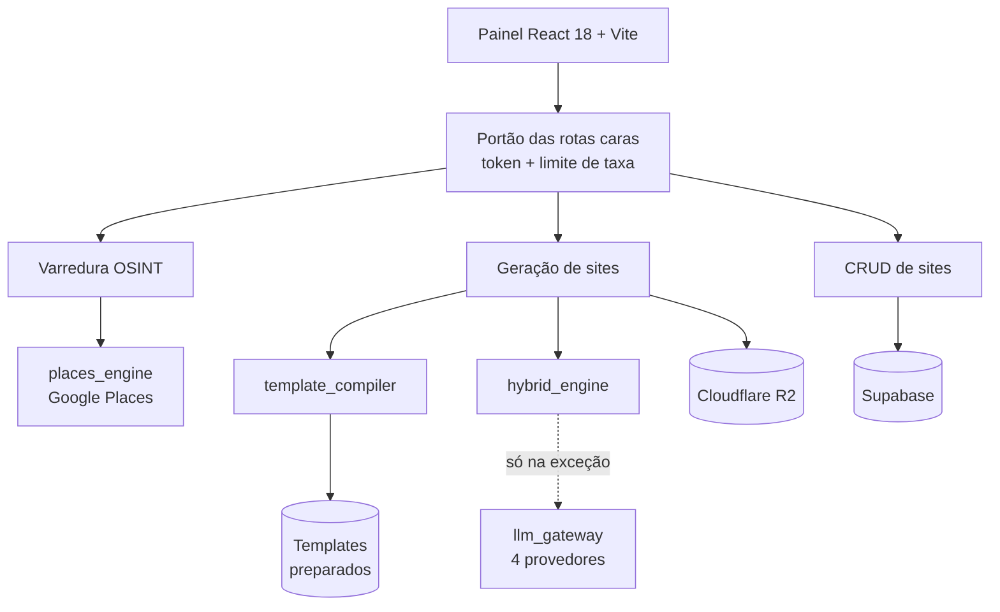

<div align="center">
  
</div>

# REPASS AI

Encontra negócios locais sem site no Google Places, gera uma landing page para
cada um em **14 ms**, e organiza a abordagem comercial num funil.

Feito para quem vende site para pequeno negócio: barbearia, padaria, petshop,
oficina. O trabalho manual — buscar no Maps, checar se tem site, montar a
página, mandar mensagem — vira um fluxo só.

[](https://react.dev)
[](https://python.org)
[](#verificando)

---

## Estado, medido em 27/07/2026

Números tirados do repositório por comando, não estimados.

| | |
|---|---|
| Código escrito | **23.819 linhas** *(Python, JSX, JS, CSS — sem contar arquivo gerado)* |
| Geração de site | **14 ms**, custo **R$ 0,00** |
| Templates prontos | **8**, todos em pt-BR |
| Nichos cobertos | 12 |
| Testes automáticos | **27** |
| Auditorias que bloqueiam entrega | 8 |

### O que funciona

Varredura no Google Places com cota e limite de taxa · geração de sites em 8
templates · persistência no Supabase com histórico de versões · publicação no
Cloudflare R2 · autenticação em 6 rotas · CRM com funil · design system com
lint que trava regressão.

### O que **não** funciona ainda

Sendo explícito, porque promessa não cumprida num README é o jeito mais rápido
de perder a confiança de quem vai ler o código:

- `POST /api/site/clone` **não clona nada** — devolve um schema fixo
- `backend/modal_engine.py` está no repositório mas tem **zero referências**
- Os templates da 77lib carregam Tailwind de CDN externo; se o CDN cair, o
  site do cliente quebra *(o template base próprio não tem esse problema)*
- O site gerado não tem `<main>` e a hierarquia de títulos pula um nível
- Sem testes end-to-end de jornada — só de backend

---

## Rodando

Precisa de **Node 18+** e **Python 3.11+**.

```bash
npm install && pip install -r backend/requirements.txt
```

```bash
cp backend/.env.example backend/.env
```

```bash
python backend/app_api.py
```

```bash
npm run dev
```

O painel sobe em `localhost:3000` e a API em `localhost:8000`. Sem as chaves do
Google Places o sistema entra em **modo demonstração**: mostra exemplos de
layout com contato em branco e selo visível — nunca inventa telefone.

### Verificando

```bash
cd backend && python test_api.py
```

```bash
npm run lint && npm run build
```

---

## Arquitetura



### A decisão central

**A IA não participa da geração de sites.**

Ela roda **uma vez por template**, na importação: traduz, classifica cada
trecho de texto e marca onde entram os dados do negócio. O resultado fica
guardado em português. Gerar um site depois é troca de texto.

```
IMPORTAR TEMPLATE            GERAR SITE
uma vez · ~90s · ~R$ 0,40    sempre · 14 ms · R$ 0,00
```

Os 8 templates chegaram em **6 idiomas** — inglês, catalão, alemão, búlgaro,
espanhol e francês. Traduzir a cada site custaria caro e traria a
imprevisibilidade da IA para o caminho crítico. Traduzir uma vez resolve os
dois problemas.

O texto é substituído **por posição em bytes**, não por busca de frase. Buscar
frase exigiria uma regra escrita à mão por frase, por template, por idioma —
cerca de 200 regras, em idiomas que ninguém da equipe revisa.

---

## Auditoria: site sujo é bloqueado, não publicado

Todo HTML passa por 8 verificações antes de ser gravado. Cada uma existe
porque o defeito **aconteceu**:

| Verificação | O que impediu |
|---|---|
| Idioma do documento | `<html lang="fr">` — todo site se declarava francês para o Google |
| Marcadores de idioma estrangeiro | parágrafos inteiros iam ao ar em francês |
| Moeda estrangeira | padaria em Franca com o cardápio em dólar |
| Dados do negócio original | telefone `+31 772 086 200` e `hello@exoape.com` no site do cliente |
| Marcador não preenchido | `{{NOME}}` cru na página |
| Consistência de variáveis | a IA traduziu a marca: `Little Latte Cafe` → *"Café com Leite Pequeno"* |
| Preço determinístico | a IA **inventou** valores: *"Entrada: R$ 1.000.000"* numa pousada |
| Alinhamento plano × extração | ids deslocados colariam cada texto no lugar errado, sem erro visível |

Todo preço herdado de template vira **"Sob consulta"**. Não sabemos o que o
cliente cobra, e preço errado numa página que ele vai divulgar é o pior
defeito possível deste produto.

**A auditoria não julga aparência.** Ela garante ausência de resíduo, não que
o layout esteja bom — isso ainda depende de alguém abrir a página.

---

## Estrutura

```
backend/
  app_api.py              servidor, rotas, autenticação, limite de taxa
  template_catalog.json   nicho → template                    (camada 1)
  template_preparer.py    extração de texto por posição       (camada 2)
  template_translator.py  classificação com IA, uma vez       (camada 3)
  template_compiler.py    compilação e seleção            (camadas 4 e 5)
  template_auditor.py     diagnóstico read-only de templates
  lib77_engine.py         motor legado + as regras de auditoria
  hybrid_engine.py        textos por nicho, sem IA
  rules/                  texto, validação e categorização
  places_engine.py        Google Places
  supabase_client.py      auth e banco
  r2_storage_engine.py    Cloudflare R2
  llm_gateway.py          4 provedores com rodízio de chaves
  miners/                 minerador de componentes MIT

src/
  App.jsx                 roteamento das 14 abas
  views/  components/     telas e peças de interface
  services/               persistência, auth, geração agêntica
  index.css               40 tokens de design

scripts/
  verificar-tokens.mjs    trava: reprova cor hex escrita à mão
  linear-sync.mjs         sincroniza o backlog com o Linear
```

---

## Documentação

| Arquivo | O que tem |
|---|---|
| [docs/README.md](docs/README.md) | **índice** — o que é referência atual e o que é histórico |
| [docs/ARQUITETURA.md](docs/ARQUITETURA.md) | mapa completo, fluxos, decisões técnicas |
| [docs/ROADMAP.md](docs/ROADMAP.md) | prioridades, riscos, decisões em aberto |
| [docs/arquitetura-visual.html](docs/arquitetura-visual.html) | os fluxogramas renderizados |
| [docs/GUIA_SUPABASE.md](docs/GUIA_SUPABASE.md) | tabelas, RLS e chaves |
| [docs/INFRASTRUCTURE.md](docs/INFRASTRUCTURE.md) | Docker, checkpoints, recuperação |
| [docs/linear/](docs/linear/) | backlog em CSV, importável no Linear |
| [docs/HANDOFF.md](docs/HANDOFF.md) | transferência do projeto para outro agente de IA |
| [docs/PROMPT_IDENTIDADE_VISUAL.md](docs/PROMPT_IDENTIDADE_VISUAL.md) | prompt para aplicar a identidade visual da marca |

O backlog operacional fica no Linear. `scripts/linear-sync.mjs` sincroniza os
CSVs com a API — é idempotente, então pode rodar mais de uma vez.

---

## Stack

React 18.2 · Vite 5 · Python 3.11+ · Supabase · Cloudflare R2 · Google Places
API · gateway multi-LLM com rodízio de chaves.

O backend usa `ThreadingHTTPServer` da biblioteca padrão, sem framework web.
É uma escolha, não um acidente: menos dependência para manter, e o volume
atual não justifica o peso de um framework. Se a carga crescer, o ponto de
troca está isolado em `app_api.py`.

<div align="center">
<br/>

<br/><br/>

</div>
