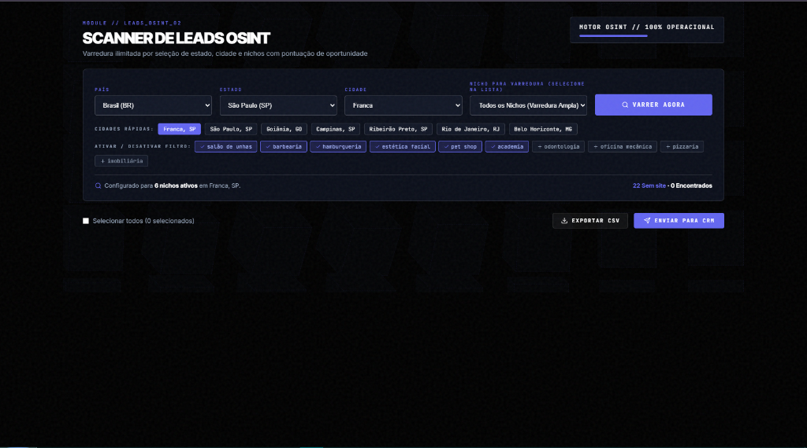
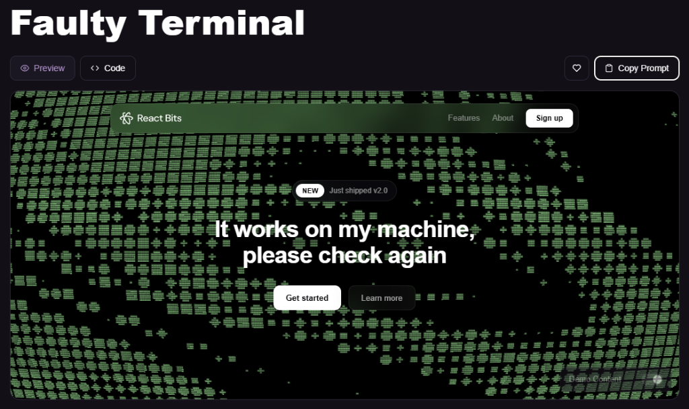
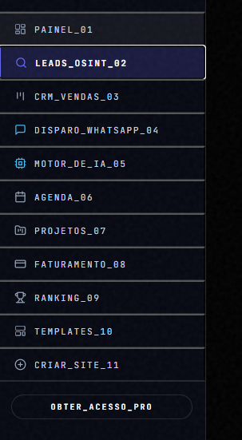

<div align="center">



<br/>
<br/>

# 🚀 REPASS AI — The Advanced OSINT & Agentic Engine

</div>

<div align="center">

## 💰 Prospecção Ilimitada & Sites Gerados por IA em Milissegundos

</div>

> Varrer o Google Places na mão, buscar fotos e criar landing pages é doloroso. O **REPASS AI** abstrai o caos agregando um **Motor OSINT de Alta Performance**, um **Pipeline de Mídia (RAG)** e uma arquitetura **Serverless Modal** num único painel estilo Hacker UI. Raspagem de 500+ leads, fotos reais e clones de sites — tudo com 1 clique.


<br/>


<br/>

<div align="center">

<h3>

⭐ Star o repo se o REPASS AI te ajudou a dominar a prospecção B2B.

</h3>

[](https://github.com/Victor-Enginner/REPASSAI)
[](https://github.com/Victor-Enginner)

<br/>

## 🧩 Funcionalidades (O que o motor entrega)

[](https://react.dev)
[](https://python.org)
[](https://modal.com)

<table>
  <tr>
    <td align="center"><b>🚀 Scanner OSINT</b><br/>Captura de Leads e Telefones Reais</td>
    <td align="center"><b>🎯 Proxy RAG Mídia</b><br/>Zero-copy Streaming de Imagens Google</td>
    <td align="center"><b>🌐 Lovable Clone Engine</b><br/>Clonagem de estruturas web em React</td>
  </tr>
  <tr>
    <td align="center"><b>🔌 Modal Serverless</b><br/>Poder GPU Elástico p/ Scraper</td>
    <td align="center"><b>🗜️ Live SSE Terminal</b><br/>Comunicação Real-Time com o Backend</td>
    <td align="center"><b>🌍 Vercel Ready</b><br/>Frontend otimizado para deploy 1-click</td>
  </tr>
</table>

</div>

<br/>
<br/>

<div align="center">

## 🆓 100% Operacional no Ambiente Local (Zero Fricção)

</div>

O REPASS AI foi blindado com a arquitetura **SaaS Premium**. Você configura suas chaves de API uma única vez no backend (`.env`) e o sistema orquestra milhares de requisições de forma isolada do frontend, garantindo que suas chaves não vazem.

```bash
# 1. Instale as dependências Python
pip install -r backend/requirements.txt

# 2. Insira sua chave do Google Places no .env
echo "GOOGLE_PLACES_API_KEY=sua_chave_aqui" > backend/.env

# 3. Rode o Backend Paralelo (ThreadingHTTPServer)
python backend/app_api.py

# 4. Inicie o Frontend Vite
npm run dev
```

<br/>

<div align="center">

# 💥 A Promessa

</div>

O **REPASS AI** resolve o funil inteiro de Vendas B2B Outbound. Você escolhe a cidade e o nicho. O nosso núcleo OSINT bate no Google, filtra os estabelecimentos, acha quem não tem site e avalia a nota. O núcleo de Mídia recupera a fachada do lugar real, e a IA monta uma Landing Page *pixel-perfect* customizada pro cara na mesma hora. 

<br/>

<div align="center">

## 🏆 O que torna o REPASS AI único?

</div>

<table>
  <tr>
    <th>Recurso</th>
    <th align="left">Descrição Técnica</th>
  </tr>
  <tr>
    <td nowrap><code>EventSource (SSE)</code></td>
    <td>Logs transmitidos do Python pro React em milissegundos sem bloquear thread.</td>
  </tr>
  <tr>
    <td nowrap><code>Modal Cloud</code></td>
    <td>Fallback dinâmico que manda o código pesado rodar num cluster Serverless caso você precise escalar 1.000 usuários ao mesmo tempo.</td>
  </tr>
  <tr>
    <td nowrap><code>Imutabilidade VDOM</code></td>
    <td>O motor blinda mutações fantasma congelando schemas JSON com `Object.freeze`.</td>
  </tr>
  <tr>
    <td nowrap><code>Lazy Async Loading</code></td>
    <td>A `<GallerySection/>` suporta dezenas de imagens HD usando `decoding="async"` para não travar a CPU do navegador.</td>
  </tr>
</table>

## ❤️ Suporte & Comunidade

O REPASS AI foi construído para elevar o nível da comunidade de desenvolvimento Hacking & OSINT.
- ⭐ **Star the repo** — Ajude o algoritmo do GitHub a notar o projeto!
- 🐛 **Report bugs** nas Issues para podermos evoluir.

<br/>

---
<div align="center">
Construído com sangue, código limpo e arquitetura pesada. <br/>
<i>Never stop coding.</i>
</div>
