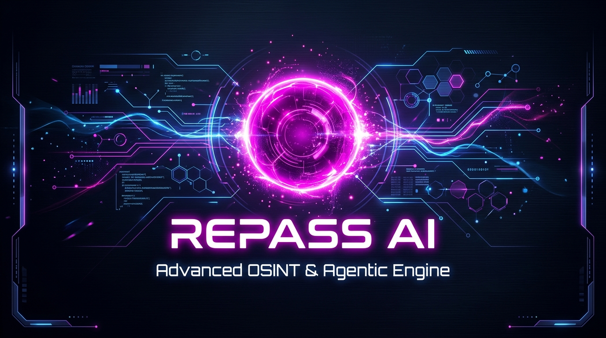
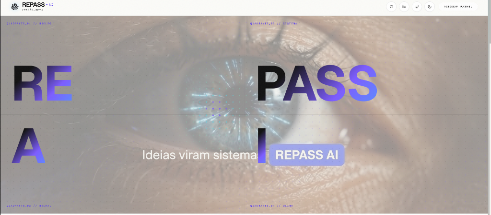
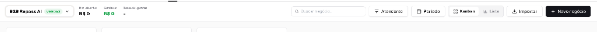
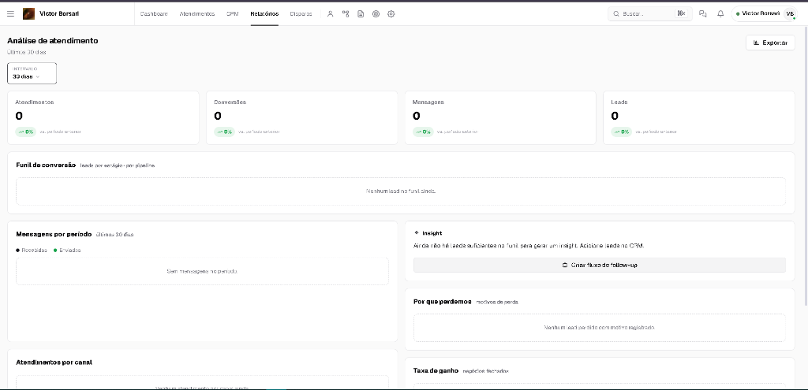
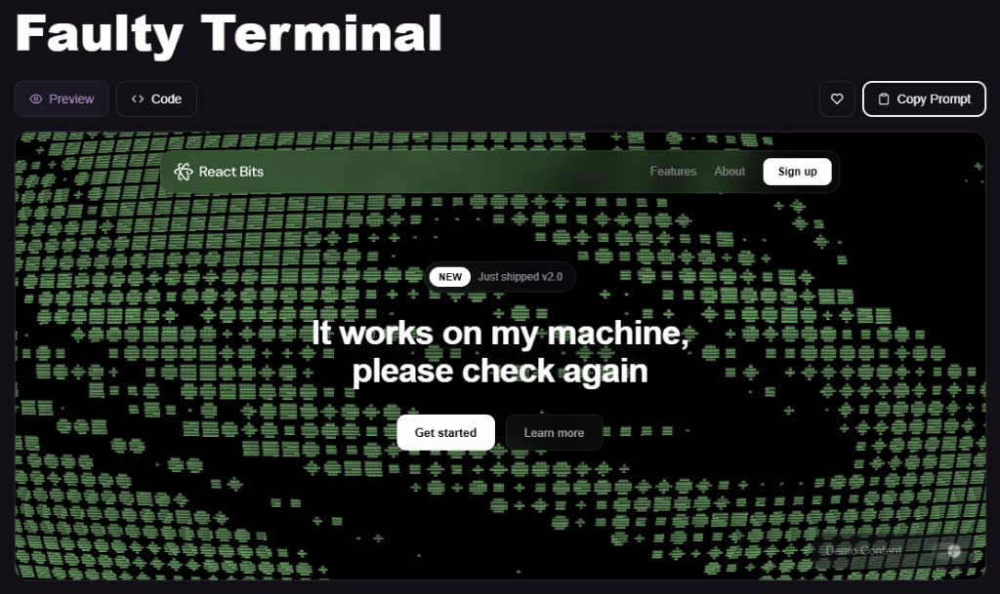
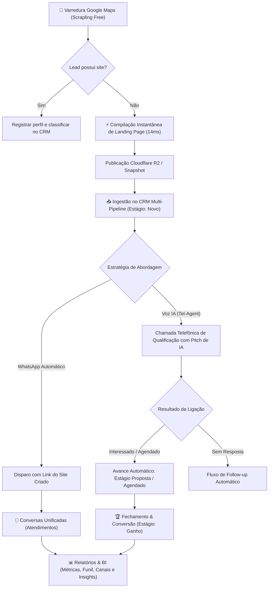
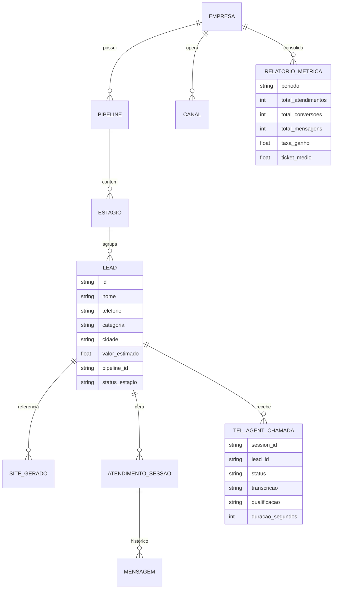

# REPASS AI — v0.0.1 (BETA MARCO INICIAL)

<div align="center">
  

  <p align="center">
    <strong>Sistema Operacional de Inteligência Comercial Autônoma, OSINT & Conversão B2B</strong>
  </p>

  <p align="center">
    <a href="#fluxograma-do-sistema"></a>
    <a href="#arquitetura-e-grafo-semântico"></a>
    <a href="#motor-scrapling-google-maps"></a>
    <a href="#agentes-de-voz-tel-agent"></a>
    <a href="#deploy-e-produção"></a>
  </p>
</div>

---

## 👁️ Visão Geral do Sistema

O **REPASS AI** é uma infraestrutura completa de ponta a ponta desenvolvida para transformar a prospecção comercial, abordagem e fechamento de serviços digitais em um fluxo unificado e automatizado:

1. **Varredura OSINT & Google Maps Free**: Coleta em lote negócios locais sem dependência ou cobranças de cartão de crédito no Google Cloud Places API através do motor nativo **Scrapling**.
2. **Geração Instantânea de Sites em 14ms**: Compila e hospeda landing pages completas e responsivas para o lead antes mesmo da abordagem inicial.
3. **CRM Multi-Pipelines com Escopo Empresarial**: Funis segmentados (`B2B Repass AI [VENDAS]`, `Prospecção Google Maps`, `Processos & Ativação`), métricas financeiras em tempo real e visão Kanban/Lista.
4. **Agentes de Voz Autônomos (Tel-Agent)**: Integração com agentes telefônicos de inteligência artificial com síntese em português brasileiro, transcrição e movimentação automática de leads no funil conforme o resultado da ligação.
5. **Central Executiva de Relatórios & Analytics**: Métricas consolidadas (Atendimentos, Conversões, Mensagens, Leads), gráfico temporal de mensagens, funil de conversão com taxa de passagem, divisão por canal (WhatsApp, Voz, Maps, Webchat), insights executivos de IA e motivos de perda.
6. **Design System Cinematográfico Dual**:
   - **Modo Branco (Light)**: Vídeo em loop de alta precisão da retina cibernética, tipografia monumental em azul gradiente profundo (`#091e42` → `#1d4ed8` → `#06b6d4`), acentos de alta tecnologia e papel editorial quente.
   - **Modo Escuro (Dark)**: Fundo grafite profundo (`#0b0c10`), traços hairline e iridescência lilás/violeta.

---

## 📸 Galerias & Telas do Sistema

### 1. Landing Page Arquitetural & Modo White Cinematográfico
> Hero section monumental com a nova identidade geométrica modular viva (Anti Gravity Living Emblem) e vídeo em loop perfeitamente integrado à malha executiva de pontos (`ExecutiveDotMatrix`).

<div align="center">
  
</div>

---

### 2. CRM Multi-Pipelines com Métricas Ativas e Gestão de Funil
> Seletor dinâmico de pipelines com escopo por empresa, Top Metrics Bar em tempo real (`Em aberto`, `Ganhos`, `Taxa de ganho`), filtros por atendente e período, e acionador de chamadas de voz IA Tel-Agent nos cards.

<div align="center">
  
</div>

---

### 3. Central de Relatórios & Análise de Atendimento
> Métricas consolidadas (Atendimentos, Conversões, Mensagens, Leads), funil de conversão horizontal por estágio, linha do tempo dia a dia de mensagens recebidas e enviadas, atendimentos por canal, insights da IA e auditoria de motivos de perda.

<div align="center">
  
</div>

---

### 4. Prospector OSINT com Motor Scrapling
> Varredura ativa do Google Maps com extração de telefones, status de site, avaliações, endereço completo e enriquecimento instantâneo com geração de site.

<div align="center">
  
</div>

---

## ⚡ Fluxograma do Sistema

O fluxo operacional do REPASS AI conecta a prospecção fria ao fechamento de contrato:


```mermaid
flowchart TD
    A["📍 Varredura Google Maps (Scrapling Free)"] --> B{"Lead possui site?"}
    B -- "Sim" --> C["Registrar perfil e classificar no CRM"]
    B -- "Não" --> D["⚡ Compilação Instantânea de Landing Page (14ms)"]
    D --> E["Publicação Cloudflare R2 / Snapshot"]
    E --> F["📥 Ingestão no CRM Multi-Pipeline (Estágio: Novo)"]
    F --> G{"Estratégia de Abordagem"}
    G -- "WhatsApp Automático" --> H["Disparo com Link do Site Criado"]
    G -- "Voz IA (Tel-Agent)" --> I["Chamada Telefônica de Qualificação com Pitch de IA"]
    I --> J{"Resultado da Ligação"}
    J -- "Interessado / Agendado" --> K["Avance Automático: Estágio Proposta / Agendado"]
    J -- "Sem Resposta" --> L["Fluxo de Follow-up Automático"]
    H --> M["💬 Conversas Unificadas (Atendimentos)"]
    K --> N["🏆 Fechamento & Conversão (Estágio: Ganho)"]
    M --> O["📊 Relatórios & BI (Métricas, Funil, Canais e Insights)"]
    N --> O
```

---

## 🧠 Grafo Semântico de Dados & Entidades

O modelo relacional semântico do REPASS AI opera em camadas desacopladas:


```mermaid
erDiagram
    EMPRESA ||--o{ PIPELINE : possui
    EMPRESA ||--o{ CANAL : opera
    PIPELINE ||--o{ ESTAGIO : contem
    ESTAGIO ||--o{ LEAD : agrupa
    LEAD ||--o{ SITE_GERADO : referencia
    LEAD ||--o{ ATENDIMENTO_SESSAO : gera
    LEAD ||--o{ TEL_AGENT_CHAMADA : recebe
    ATENDIMENTO_SESSAO ||--o{ MENSAGEM : historico
    EMPRESA ||--o{ RELATORIO_METRICA : consolida

    LEAD {
        string id
        string nome
        string telefone
        string categoria
        string cidade
        float valor_estimado
        string pipeline_id
        string status_estagio
    }

    TEL_AGENT_CHAMADA {
        string session_id
        string lead_id
        string status
        string transcricao
        string qualificacao
        int duracao_segundos
    }

    RELATORIO_METRICA {
        string periodo
        int total_atendimentos
        int total_conversoes
        int total_mensagens
        float taxa_ganho
        float ticket_medio
    }
```

---

## 🛠️ Instalação & Execução Local

### Pré-requisitos
- **Node.js**: v18.0.0 ou superior (v20+ recomendado)
- **Python**: v3.11 ou superior
- **Git**

### Passo a Passo

1. **Clone o repositório**:
```bash
git clone https://github.com/Victor-Enginner/Repass-Ai.git
cd Repass-Ai
```

2. **Instale as dependências**:
```bash
npm install
pip install -r backend/requirements.txt
```

3. **Inicie o Frontend e Backend simultaneamente com portas isoladas**:
```bash
node scripts/dev.mjs
```

O script inicializador unificado irá:
- Liberar automaticamente as portas e limpar processos zumbis;
- Subir a **API Python** em `http://localhost:8001`;
- Subir o **Frontend Vite** em `http://localhost:3001` (isolado para evitar conflito com outros projetos locais).

---

## 🚢 Deploy e Produção

### Deploy Estático no Netlify

O frontend do REPASS AI está pré-configurado com [`netlify.toml`](./netlify.toml) e redirecionamento SPA ([`public/_redirects`](./public/_redirects)):

```bash
# Build de produção
npm run build

# Deploy via Netlify CLI
npx netlify deploy --prod --dir=dist
```

### Build e Auditoria de Design Tokens
O projeto possui um linter estrito de design system que impede regressões visuais:
```bash
# Validação de tokens CSS
npm run lint

# Build de produção otimizado
npm run build
```

---

## 📜 Histórico de Versões
- **v0.0.1 (Atual)**:
  - Marco Inicial Oficial do Repositório `Victor-Enginner/Repass-Ai`.
  - Motor Scrapling 100% Free no Prospector Google Maps.
  - CRM Multi-Pipeline com escopo por empresa e filtros avançados.
  - Integração nativa com Tel-Agent Voz IA e síntese em PT-BR.
  - Aba de Relatórios & BI com funil de conversão, gráficos temporais e insights da IA.
  - Landing page cinematográfica com vídeo em loop no Modo White e cores elétricas.

---

<div align="center">
  <sub>Construído com obsessão por velocidade, estética e conversão comercial. REPASS AI © 2026.</sub>
</div>
