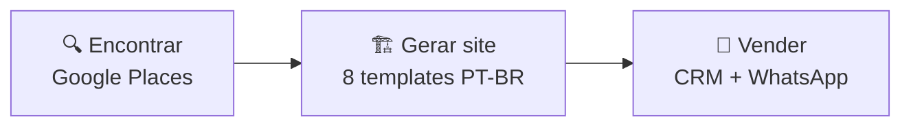
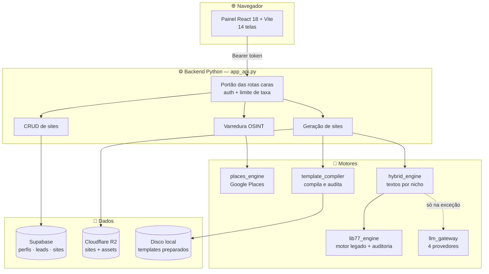
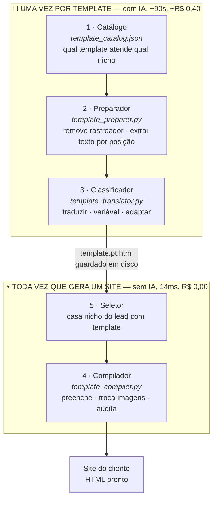
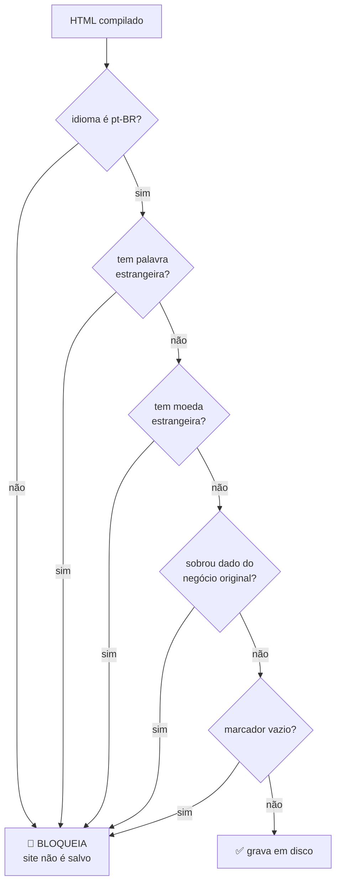
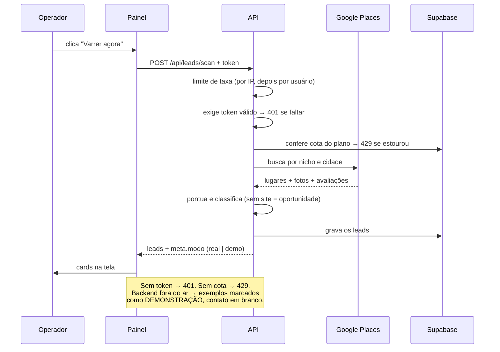
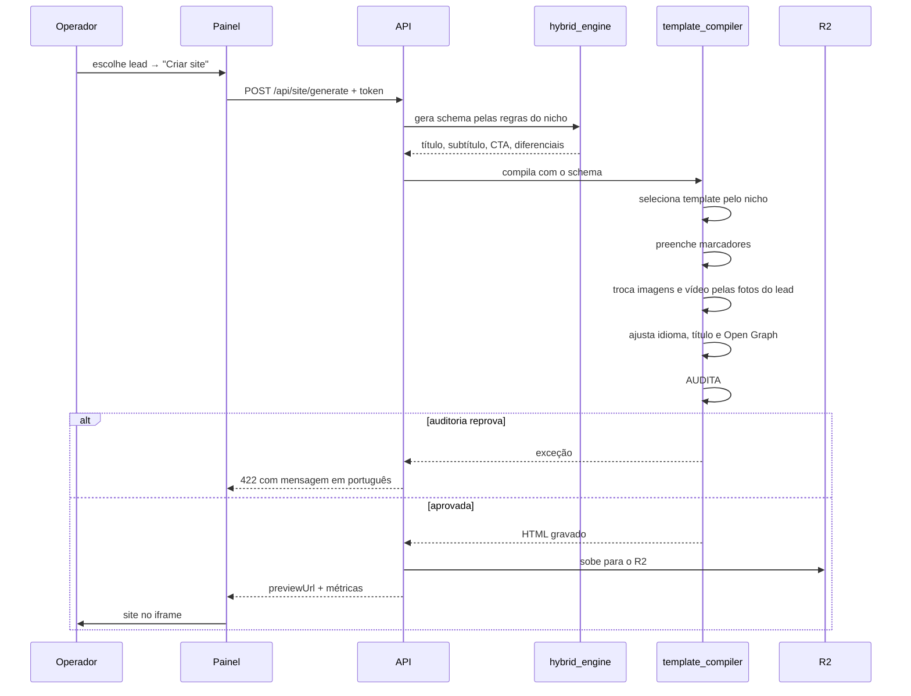

# REPASS AI — Arquitetura do Sistema

> Documento vivo. Toda medida aqui foi tirada do repositório em **27/07/2026**,
> não estimada. Os diagramas são Mermaid: renderizam no GitHub, no Linear e no
> VS Code (extensão Markdown Preview Mermaid Support).

---

## 1. O que o produto faz

Encontra negócios locais que não têm site, gera um site pronto para cada um em
milissegundos e organiza a abordagem comercial. Três etapas:



---

## 2. Tamanho real

| Área | Linhas |
|---|---|
| Backend Python | 6.550 |
| Telas (views) | 4.561 |
| Componentes | 3.623 |
| Serviços do frontend | 1.669 |
| Scripts de manutenção | 700 |
| **Código escrito** | **24.264** |

Medido em 27/07/2026 contando `.py`, `.jsx`, `.js`, `.mjs` e `.css`, incluindo
arquivos ainda não commitados.

### De onde vem cada linha do repositório

O repositório inteiro soma **371.638 linhas**. A composição:

| Origem | Linhas | O que é |
|---|---|---|
| **Código que escrevemos** | **24.264** | Python, JSX, JS, CSS — 109 arquivos |
| Binários contados como texto | 71.084 | PNG, um MP4 e dois ZIP |
| Componentes minerados | 36.330 | biblioteca MIT de terceiros |
| Templates preparados | 38.120 | HTML e planos de tradução gerados |
| Sites gerados e amostras | 29.315 | saída do compilador |
| `package-lock` e afins | 9.101 | travas de dependência |

Um vídeo de 19 mil "linhas" tem esse tamanho porque o contador soma bytes de
quebra de linha dentro do binário. Só a primeira linha descreve código escrito
por alguém — e é o primeiro número que um revisor confere.

---

## 3. Mapa do sistema



**Regra que atravessa tudo:** a IA não participa da geração de sites. Ela roda
uma vez por template, na importação. Gerar site é troca de texto — R$ 0,00 e
milissegundos.

---

## 4. Pipeline de templates — as 5 camadas

O coração do produto. Separa o que é caro e raro (traduzir) do que é barato e
constante (gerar).



### Por que texto é trocado por POSIÇÃO e não por frase

O motor antigo procurava frases conhecidas (`"Voir la Vidéo"`) e substituía.
Isso exigia uma regra escrita à mão por frase, por template, por idioma. Os 8
templates chegaram em **6 idiomas** — inglês, catalão, alemão, búlgaro,
espanhol e francês. Seriam ~200 regras impossíveis de revisar.

Hoje cada trecho é localizado pelo deslocamento em bytes dentro do HTML.
Recortar e colar por posição funciona igual em qualquer idioma.

### Os três destinos de cada trecho

| Destino | O que é | Exemplo |
|---|---|---|
| `traduzir` | interface do template | `Home` → `Início` |
| `variavel` | dado do negócio | `Little Latte Cafe` → `{{NOME}}` |
| `adaptar` | conteúdo do dono original | `Strawberry Dirty Soda` → `Pão de Queijo` |

Sem essa separação o site sairia em português **falando de outra empresa**.

---

## 5. As redes de proteção

Cada uma nasceu de um defeito que chegou a acontecer. Estão documentadas aqui
para não serem removidas por parecerem redundantes.



| Proteção | Defeito real que ela impediu |
|---|---|
| Idioma do documento | `<html lang="fr">` — todo site declarava ser francês para o Google |
| Marcadores de francês | parágrafos inteiros iam ao ar em francês |
| Moeda estrangeira | padaria em Franca com cardápio em dólar |
| Dados do original | telefone `+31 772 086 200` e `hello@exoape.com` no site do cliente |
| Marcador vazio | `{{NOME}}` cru aparecendo na página |
| Consistência de variáveis | a IA traduziu a marca: `Little Latte Cafe` → `"Café com Leite Pequeno"` |
| Preço determinístico | a IA **inventou** valores: `"Entrada: R$ 1.000.000"` numa pousada |
| Alinhamento plano × extração | ids deslocados colariam cada texto no lugar errado, sem erro nenhum |

> **Nunca confie só na auditoria para julgar qualidade.** Ela garante que não há
> resíduo; não garante que o layout está bonito. O texto sobrepondo o menu
> passou por ela e só foi pego olhando a tela.

---

## 6. Fluxo de uma varredura de leads



**Regra de integridade:** quando a busca real falha, o sistema mostra exemplos
de layout — mas com contato **vazio** e selo de demonstração. Nunca inventa
telefone. Um número sorteado pertence a alguém.

---

## 7. Fluxo de geração de um site



---

## 8. Navegação do painel — 14 telas

```mermaid
flowchart TB
    LP["🏠 Landing"] --> LOGIN["🔑 Login"]
    LOGIN -->|"entrar ou modo demo"| DASH["📊 Painel"]

    DASH --> LEADS["🔍 Scanner de Leads"]
    DASH --> CRM["📋 Funil de Vendas"]
    DASH --> PROJ["📁 Meus Sites"]

    LEADS -->|"Enviar para CRM<br/><b>não troca de aba</b>"| LEADS
    LEADS -->|"Criar site"| EDITOR["🎨 Editor de Site"]
    LEADS --> WIZARD["✨ Criar Site"]

    CRM --> BULK["💬 Abordagem 1-a-1"]
    WIZARD --> EDITOR
    PROJ --> EDITOR
    EDITOR --> CHAT["🤖 Chatbot Agêntico"]

    DASH --> TPL["🛒 Loja de Templates"]
    DASH --> ENGINE["⚡ Motor Neural"]
    DASH --> AGENDA["📅 Agenda"]
    DASH --> BILL["💰 Faturamento"]
    DASH --> AFF["🤝 Indicações"]
    DASH --> RANK["🏆 Ranking"]

    style LEADS fill:#1e3a5f
    style EDITOR fill:#1e3a5f
    style CRM fill:#1e3a5f
```



As três telas destacadas são o caminho que gera receita: **encontra → gera →
vende**. O resto é apoio.

---

## 9. Endpoints

| Rota | Auth | O que faz |
|---|:---:|---|
| `POST /api/leads/scan` | 🔒 | varredura no Google Places |
| `POST /api/site/generate` | 🔒 | compila o site do lead |
| `POST /api/site/clone` | 🔒 | ⚠️ não clona — devolve schema fixo |
| `POST /api/ai/generate` | 🔒 | chamada de LLM |
| `GET/POST /api/sites` | 🔒 | lista e salva sites do usuário |
| `GET /api/sites/detail` | 🔒 | um site + histórico de versões |
| `GET /api/site/preview_html` | — | serve o HTML no iframe |
| `GET /api/media/proxy` | — | proxy de fotos do Places (allowlist) |
| `GET /api/templates*` | — | loja de templates |
| `GET /api/health` · `/api/system/status` | — | diagnóstico |
| `GET /api/logs/stream` | — | log ao vivo (SSE) |

🔒 = exige token válido. Sem token: **401**. Acima de 30 requisições por
minuto: **429** com `Retry-After`.

---

## 10. Onde cada coisa mora

```
backend/
  app_api.py              servidor, rotas, portão de auth e limite
  template_catalog.json   ← nicho → template            (camada 1)
  template_preparer.py    ← extração por posição        (camada 2)
  template_translator.py  ← classificação com IA        (camada 3)
  template_compiler.py    ← compilação e seleção      (camadas 4 e 5)
  lib77_engine.py         motor legado + AUDITORIA (usada por todos)
  hybrid_engine.py        textos por nicho, sem IA
  rules/                  regras de texto, validação e categorização
  places_engine.py        Google Places
  scraper_monster.py      pontuação e classificação de leads
  supabase_client.py      auth e banco
  r2_storage_engine.py    Cloudflare R2
  llm_gateway.py          4 provedores com rodízio de chaves
  miners/                 minerador de componentes (1.140 MIT)
  data/
    templates_preparados/ ← os 8 templates em português
    77lib_catalog/        ← sites gerados
    asset_library/        ← componentes minerados (fora do git)

src/
  App.jsx                 roteamento das 14 abas + estado dos leads
  views/                  as telas
  components/             cartões, sidebar, chatbot, WebGL
  services/               documentDB (Supabase), auth, geração agêntica
  index.css               40 tokens de design

scripts/
  verificar-tokens.mjs    trava: reprova cor hex escrita à mão
  migrar-cores-para-tokens.mjs
```

---

## 11. Decisões técnicas e o porquê

| Decisão | Motivo |
|---|---|
| IA só na importação de template | 8 chamadas na vida do projeto, não uma por site. Custo de geração cai a zero |
| Texto por posição, não por frase | 6 idiomas; regra por frase não escala |
| Preço sempre "Sob consulta" | a IA inventou valores. Não sabemos o que o cliente cobra |
| Contato ausente fica **vazio** | telefone sorteado pertence a alguém de verdade |
| Auditoria bloqueia, não avisa | site sujo publicado é pior que site não publicado |
| Limite de taxa antes do token | validar token custa uma chamada ao Supabase |
| Cota cobrada só na criação | cobrar a cada save esvaziaria o plano em minutos |
| `upsert` em vez de select+insert | editor e chatbot salvavam juntos e colidiam (HTTP 409) |
| Lint que reprova cor hex | sem trava, as cores voltam: foram de 619 para 870 entre sprints |
| Marcador `enviado_crm` | `status_crm` tem 3 vocabulários diferentes no sistema |

---

## 12. Estado verificado

```
27 testes backend          OK  (23 API + 4 motor híbrido)
12 nichos compilando       OK  média 14 ms
8 templates em pt-BR       OK  935 trechos, 0 perdidos
17 rastreadores do 77lib   removidos
lint de design system      24 arquivos limpos
build de produção          ~10s, sem erro
```

**Não verificado:** aparência das páginas em navegador real, Lighthouse, e o
ciclo login → gerar → recarregar com conta de verdade.

---

## 13. Dívida conhecida

Rastreada no Linear. Resumo:

- `/api/site/clone` não clona — decidir entre implementar ou remover da interface
- `modal_engine.py` sem uso — código morto
- 6 `except Exception` genéricos no `app_api.py`
- Loja de templates e catálogo do gerador são **listas separadas** e podem
  divergir
- Nome de produto e descrição são adaptados isoladamente e podem descolar
- Site gerado não tem `<main>` e pula de `<h2>` para texto
- Templates carregam Tailwind de CDN externo — quebram se o CDN cair
