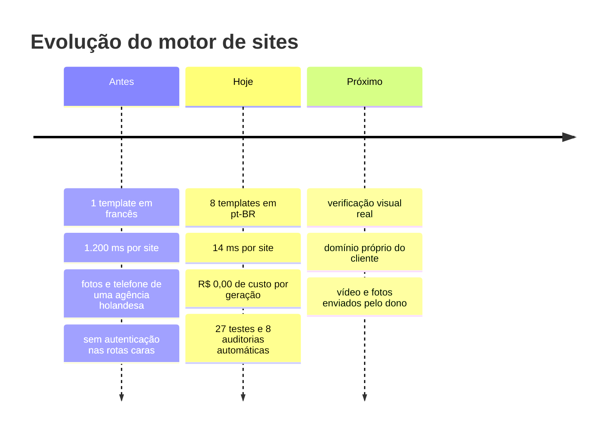

# REPASS AI — Roadmap

> Atualizado em **27/07/2026**. O backlog detalhado está no Linear (projeto
> REPASS AI). Este documento é a visão de cima: o que já sustenta o produto,
> o que falta, e em que ordem.

---

## Linha do tempo



---

## O que já sustenta o produto

| Bloco | Estado |
|---|---|
| Varredura de leads (Google Places) | ✅ funcionando, com cota e limite de taxa |
| Geração de sites — 5 camadas | ✅ 12 nichos compilando em 14 ms |
| 8 templates traduzidos | ✅ 935 trechos, nenhum perdido |
| Auditoria que bloqueia site sujo | ✅ 8 regras |
| Autenticação e limite de taxa | ✅ 6 rotas protegidas |
| Persistência no Supabase | ✅ CRUD, versões, migração, cota |
| Design system com trava de lint | ✅ 40 tokens, 24 arquivos limpos |
| Mobile | ✅ drawer, grids fluidos |
| Biblioteca de 1.140 componentes MIT | ✅ minerada, no R2 |
| Loja de templates | ✅ 9 templates, preço opcional |

---

## Ordem recomendada

O critério é o mesmo desde o começo: **primeiro o que perde cliente ou
dinheiro, depois o que perde tempo.**


### 1 · Verificar na tela — *antes de qualquer coisa nova*

A auditoria prova que não há resíduo. **Não prova que a página está bonita.**
O texto sobrepondo o menu passou por ela e só foi pego olhando.

- Abrir os 12 sites gerados e anotar o que está feio
- Rodar Lighthouse no painel e num site gerado
- Fazer o ciclo login → gerar → recarregar com conta real

Nada disso precisa de código novo. Precisa de olho.

### 2 · Mídia do cliente

Hoje o site usa fotos do Google Places ou uma imagem genérica do nicho, e a
seção de vídeo mostra um quadro estático.

- Campo para o dono enviar fotos próprias
- Campo para o vídeo da seção "Experiência Ao Vivo"
- Guardar no R2, por site

É o que mais aproxima o site gerado de um site feito à mão.

### 3 · Domínio próprio

Hoje publica em `pub-*.r2.dev`. O cliente vê uma URL que não é a marca dele —
e isso vira objeção na hora de vender.

- Domínio próprio servindo o bucket
- Worker de CNAME para `site.cliente.com.br`
- Botão "Publicar" refletindo o estado real

### 4 · Acabamento e alcance

- Componentes `Botao`, `Card`, `Campo`, `Selo` (941 estilos inline hoje)
- Escala tipográfica fluida
- Testes end-to-end com Playwright
- i18n (pt-BR / en / es)
- Pré-renderizar os 34 blocos para composição de sites

---

## Decisões em aberto

| Questão | Quem decide |
|---|---|
| `/api/site/clone` — implementar ou remover da interface? | Victor |
| Tela para editar preço de template, ou editar o arquivo? | Victor |
| Unificar loja de templates e catálogo do gerador? | Victor |
| Rotacionar as chaves expostas no histórico do git? | decidido: **não**, risco aceito enquanto o repo for privado |

---

## Riscos conhecidos

| Risco | Impacto | Mitigação atual |
|---|---|---|
| Tailwind vem de CDN externo | site do cliente quebra se o CDN cair | nenhuma — item aberto |
| Loja e catálogo são listas separadas | template novo na loja não aparece no gerador | nenhuma — item aberto |
| Limitador de taxa é em memória | com mais de uma instância o teto vira N × 30 | aceitável com 1 processo |
| Chaves no histórico do git | quem clonar o repo tem acesso | repositório privado |
| Provedores de LLM lentos | importar template pode levar 10 min em vez de 90s | rodízio entre 4 provedores |

---

## Como medir se está indo bem

Números que valem acompanhar, todos verificáveis por comando:

```bash
cd backend && python test_api.py          # 23 testes
cd backend && python test_hybrid_engine.py # 4 testes
npm run lint                               # cor hex à mão
npm run build                              # build de produção
```

| Indicador | Hoje | Meta |
|---|---|---|
| Tempo de geração | 14 ms | < 1.500 ms |
| Custo por site | R$ 0,00 | R$ 0,00 |
| Nichos cobertos | 12 | 20 |
| Sites reprovados na auditoria | 0 de 12 | 0 |
| Cor hex escrita à mão | 0 | 0 |
| Testes | 27 | crescendo com cada correção |
